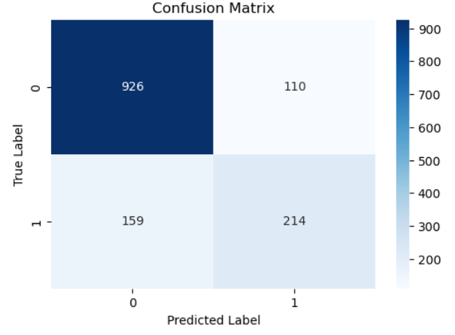
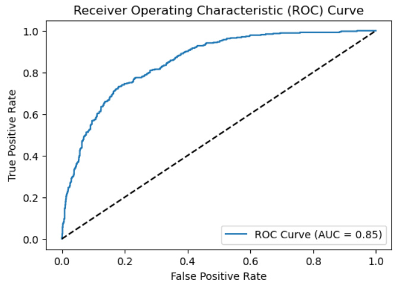

# Customer Churn Prediction Using Deep Neural Network

This project implements a deep neural network (DNN) model for predicting customer churn using the **Telco Customer Churn** dataset. It focuses on building a robust system to help businesses understand which customers are likely to leave and provides performance evaluations using various metrics and visualizations.

## Table of Contents
- [Dataset](#dataset)
- [Project Structure](#project-structure)
- [Requirements](#requirements)
- [Model Architecture](#model-architecture)
- [Evaluation](#evaluation)
- [Results](#results)
- [How to Run](#how-to-run)

## Dataset
The **Telco Customer Churn** dataset contains information on a telecommunication company's customer base, including features like:
- **Demographic Information** (gender, age)
- **Services Signed Up** (internet service, phone, streaming)
- **Account Information** (contract type, tenure, monthly charges)

The dataset is publicly available and can be found [here](https://www.kaggle.com/datasets/blastchar/telco-customer-churn).

## Project Structure

```
|-- customer_churn_prediction_dnn.ipynb    # Jupyter Notebook with full implementation
|-- README.md                             # This README file
|-- roc_curve.png
|-- confusion_matrix.png
```

## Requirements

To run this project, you'll need the following libraries installed:

```bash
pip install pandas numpy matplotlib seaborn scikit-learn tensorflow

```

## Model Architecture
The deep neural network consists of:
- **Input Layer**: Number of features in the dataset.
- **Hidden Layers**: 
  - 3 fully connected (Dense) layers with 64, 32, and 16 neurons respectively.
  - ReLU activation for non-linearity.
  - Dropout layers to prevent overfitting.
- **Output Layer**: Single neuron with sigmoid activation for binary classification (Churn or Not Churn).

**Loss Function**: Binary Crossentropy  
**Optimizer**: Adam

The model is trained for 20 epochs with a validation split of 0.2.

## Evaluation

After training, the model is evaluated on the test set using the following metrics:
- **Accuracy**: Overall performance of the model.
- **Confusion Matrix**: Visualizes correct and incorrect classifications.
- **Classification Report**: Precision, recall, and F1-score for each class.
- **ROC-AUC Curve**: Area under the curve showing model's ability to distinguish between the classes.

## Results

The model achieved the following performance on the test set:
- **Accuracy**: 81%
- **AUC Score**: 0.85

### Visualizations
- **Confusion Matrix**:
  
  
  
- **ROC Curve**:
  
  

## How to Run

1. Clone the repository:
   ```bash
   git clone https://github.com/ahmdmohamedd/customer-churn-prediction-dnn.git
   ```

2. Navigate to the project directory:
   ```bash
   cd customer-churn-prediction-dnn
   ```

3. Open the Jupyter Notebook:
   ```bash
   jupyter notebook customer_churn_prediction_dnn.ipynb
   ```

4. Run all cells in the notebook to preprocess the data, train the model, and evaluate its performance.
